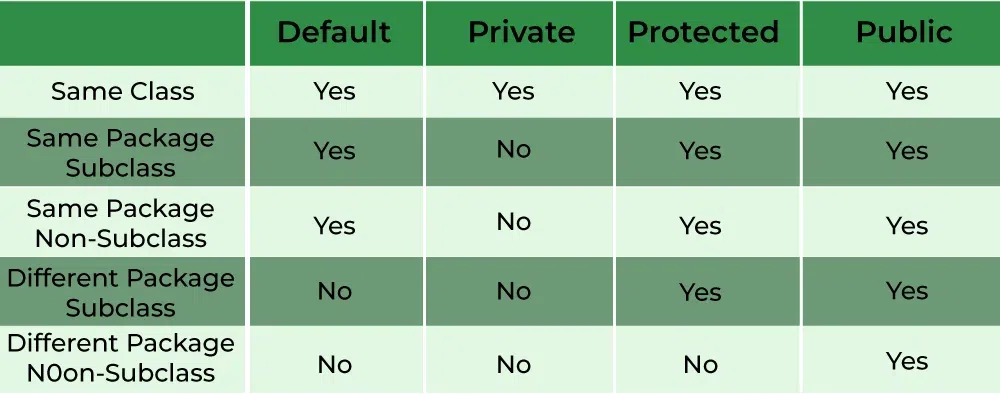

# Access Modifiers

### Private 
The private access modifier is specified using the keyword private. The methods or data members declared as private are accessible only within the class in which they are declared.

 - Any other class of the same package will not be able to access these members.
 - Top-level classes or interfaces can not be declared as private because
   - private means “only visible within the enclosing class”.
   - protected means “only visible within the enclosing class and any subclasses”

Hence these modifiers in terms of application to classes, apply only to nested classes and not on top-level classes

### Default
When no access modifier is specified for a class, method, or data member – It is said to be having the default access modifier by default. The data members, classes, or methods that are not declared using any access modifiers i.e. having default access modifiers are accessible only within the same package.

### Protected
The protected access modifier is specified using the keyword protected.

The methods or data members declared as protected are accessible within the same package or subclasses in different packages.

### Public
The public access modifier is specified using the keyword public. 
 - The public access modifier has the widest scope among all other access modifiers.
 - Classes, methods, or data members that are declared as public are accessible from everywhere in the program. There is no restriction on the scope of public data members.

**Important Points**
 - If other programmers use your class, try to use the most restrictive access level that makes sense for a particular member. Use private unless you have a good reason not to.
 - Avoid public fields except for constants.

 

##### Algorithm to use Access Modifiers in Java
 - **Define a class**: Create a class that represents the object you want to manage.
 - **Define instance variables**: Within the class, define instance variables that represent the data you want to manage.
 - **Specify an access modifier**: For each instance variable, specify an access modifier that determines the visibility of the variable. The three main access modifiers in Java are private, protected, and public.
 - **Use private for variables that should only be accessible within the class**: If you want to prevent access to a variable from outside the class, use the private access modifier. This is the most restrictive access modifier and provides the greatest level of encapsulation.
 - **Use protected for variables that should be accessible within the class and its subclasses**: If you want to allow access to a variable from within the class and its subclasses, use the protected access modifier. This is less restrictive than private and provides some level of inheritance.
 - **Use public for variables that should be accessible from anywhere**: If you want to allow access to a variable from anywhere, use the public access modifier. This is the least restrictive access modifier and provides the least amount of encapsulation.
 - **Use accessor and mutator methods to manage access to the variables**: In order to access and modify the variables, use accessor (getter) and mutator (setter) methods, even if the variables have a public access modifier. This provides a level of abstraction and makes your code more maintainable and testable.
  