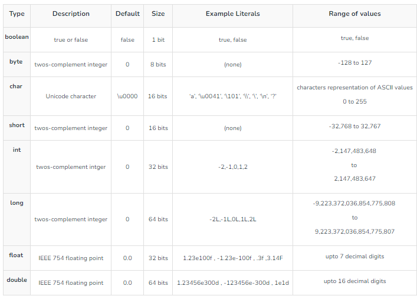

# Java Fundamentals

## Variables

#### What are Variables?
 - Variables are nothing but imaginery boxes used to store data in memory during program execution. In Java, you need to declare a variable before using it.

#### Rules to declare variables in Java
 - A variable name can consist of Capital letters A-Z, lowercase letters a-z digits 0-9, and two special characters such as _ underscore and $ dollar sign.
 - The first character must not be a digit.
 - Blank spaces cannot be used in variable names.
 - Java keywords cannot be used as variable names.
 - Variable names are case-sensitive.
 - There is no limit on the length of a variable name but by convention, it should be between 4 to 15 chars.
 - Variable names always should exist on the left-hand side of assignment operators.

Some Important Points about Variable scope in Java:  

 - In general, a set of curly brackets { } defines a scope.
 - In Java, we can usually access a variable as long as it was defined within the same set of brackets as the code we are writing or within any curly brackets inside of the curly brackets where the variable was defined.
 - Any variable defined in a class outside of any method can be used by all member methods.
 - When a method has the same local variable as a member, "this" keyword can be used to reference the current class variable.
 - For a variable to be read after the termination of a loop, It must be declared before the body of the loop.

#### Data Types
 - Java supports various data types, including primitive types (int, double, boolean) and reference types or non-primitive date types (String, arrays, objects, class, interface).
 - Primitive data types in Java are categorized into four groups: integer types, floating-point types, character type, and boolean type.


Examples of variable initializations and declarations
```
int number; // variable declaration
number = 56; // variable initialization
String name = "Nayan" // variable declaration and initialization
```



#### Non-Primitive Data types or Reference data types
The Reference Data Types will contain a memory address of variable values because the reference types won’t store the variable value directly in memory. They are strings, objects, arrays, etc. 

**Strings**
Strings are defined as an array of characters. The difference between a character array and a string in Java is, that the string is designed to hold a sequence of characters in a single variable whereas, a character array is a collection of separate char-type entities. Unlike C/C++, Java strings are not terminated with a null character.

**Class**
A class is a user-defined blueprint or prototype from which objects are created.  It represents the set of properties or methods that are common to all objects of one type. In general, class declarations can include these components, in order: 
 - Modifiers: A class can be public or has default access. Refer to access specifiers for classes or interfaces in Java
 - Class name: The name should begin with an initial letter (capitalized by convention).
 - Superclass(if any): The name of the class's parent (superclass), if any, preceded by the keyword extends. A class can only extend (subclass) one parent.
 - Interfaces(if any): A comma-separated list of interfaces implemented by the class, if any, preceded by the keyword implements. A class can implement more than one interface.
 - Body: The class body is surrounded by braces, { }.

**Object**
It is a basic unit of Object-Oriented Programming and represents real-life entities.  A typical Java program creates many objects, which as you know, interact by invoking methods. An object consists of :
 - State: It is represented by the attributes of an object. It also reflects the properties of an object.
 - Behavior: It is represented by the methods of an object. It also reflects the response of an object to other objects.
 - Identity: It gives a unique name to an object and enables one object to interact with other objects.

**Interface**
Like a class, an interface can have methods and variables, but the methods declared in an interface are by default abstract (only method signature, no body).   
- Interfaces specify what a class must do and not how. It is the blueprint of the class.
- An Interface is about capabilities like a Player may be an interface and any class implementing Player must be able to (or must implement) move(). So it specifies a set of methods that the class has to implement.
- If a class implements an interface and does not provide method bodies for all functions specified in the interface, then the class must be declared abstract.
- A Java library example is Comparator Interface. If a class implements this interface, then it can be used to sort a collection.

**Array**
An array is a group of like-typed variables that are referred to by a common name. Arrays in Java work differently than they do in C/C++. The following are some important points about Java arrays. 
- In Java, all arrays are dynamically allocated.
- Since arrays are objects in Java, we can find their length using member length. This is different from C/C++ where we find length using size.
- A Java array variable can also be declared like other variables with [] after the data type.
- The variables in the array are ordered and each has an index beginning from 0.
- Java array can also be used as a static field, a local variable, or a method parameter.
- The size of an array must be specified by an int value and not long or short.
- The direct superclass of an array type is Object.
Every array type implements the interfaces Cloneable and java.io.Serializable.

## Operators and Expressions
 - Operators are used to perform operations on variables and values. Java
supports a wide range of operators, including arithmetic, assignment, comparison, logical, and more.
 - Arithmetic operators: +, -, *, /, % (modulus).
 - Assignment operators: =, +=, -=, *=, /=.
 - Comparison operators: ==, !=, >, <, >=, <=.
 - Logical operators: && (AND), || (OR), ! (NOT).

## Type Conversion in Java

  When you assign a value of one data type to another, the two types might not be compatible with each other. If the data types are compatible, then Java will perform the conversion automatically known as Automatic Type Conversion, and if not then they need to be cast or converted explicitly.
  Let's look at both the conversions.

  1. Widening or Automatic Type Conversion
    Widening conversion takes place when two data types are automatically converted. This happens when:  
     - The two data types are compatible.
     - When we assign a value of a smaller data type to a bigger data type.

    Byte -> Short -> Int -> Long -> Float -> Double

<br>
  1. Narrowing or Explicit Conversion
   If we want to assign a value of a larger data type to a smaller data type we perform explicit type casting or narrowing.  

- This is useful for incompatible data types where automatic conversion cannot be done.
- Here, the target type specifies the desired type to convert the specified value to.

```
Double -> Float -> Long -> Int -> Short -> Byte
```    

#### How does Java handle Unicode characters? Why is it important?
Java uses Unicode to handle character encoding, allowing it to support characters from various writing systems. Unicode is important as it ensures proper representation of characters from different languages and helps in creating internationalized applications that can work across different locales.
