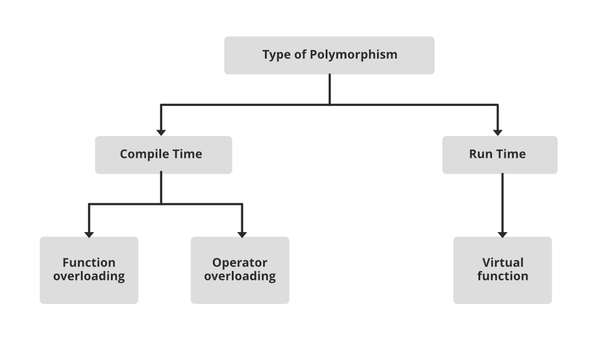

# OOPS in Java

#### What is Object Oriented Programming?
It is a methodology or paradigm to design a program using classes and objects. It simplifies the software development and maintenance by implementing real-world entities like inheritance, hiding, polymorphism, etc in programming. The main aim of OOP is to bind together the data and the functions that operate on them so that no other part of the code can access this data except that function.
Below are the few most important OOPs concepts used in programming
- Class
- Objects
- Data Abstraction
- Encapsulation
- Inheritance
- Polymorphism
- Dynamic Binding
- Message Passing

Let us study and understand this concepts in detail

#### Class
 It is a user-defined data type which defines its properties and its functions. Class is the only logical representation of the data. It represents the set of properties or methods that are common to all objects of one type. A class is like a blueprint for an object. 
 
 For example, Human being is a class. The body parts of a human being are its properties, and the actions performed by the body parts are known as functions. Consider another example as the Class of Cars. There may be many cars with different names and brands but all of them will share some common properties like all of them will have 4 wheels, Speed Limit, Mileage range, etc. So here, Car is the class, and wheels, speed limits, mileage are their properties.
 
 Note: The class does not occupy any memory space till the time an object is instantiated. 

#### Objects
 It is a basic unit of Object-Oriented Programming and represents the real-life entities. It is an instance of the class. An object can represent a person, place or any other item and thus has an identity, state and behavior. When a class is defined, no memory is allocated but when it is instantiated (i.e. an object is created using a new keyword) then space is allocated for the variable in a heap, and the starting address is stored in the stack memory. An object can operate on both data members and member functions. 

 Each object contains data and code to manipulate the data. Objects can interact without having to know details of each other’s data or code, it is sufficient to know the type of message accepted and type of response returned by the objects. 

### Instance Variables
Instance variables are non-static variables declared inside a class. Each object of the class has its own copy of these variables.

Example

```
class Student {
    String name;
    int age;
}
```

### Instance Methods
Instance methods are non-static methods that operate on the instance variables of a class.

Example
```
class Circle {
    double radius;
    double calculateArea() {
        return Math.PI * radius * radius;
    }
}
```

#### this Keyword in Java
‘this’ is a reference variable that refers to the current object, or can be said “this” in Java is a keyword that refers to the current object instance. It can be used to call current class methods and fields, to pass an instance of the current class as a parameter, and to differentiate between the local and instance variables. Using “this” reference can improve code readability and reduce naming conflicts.

Following are the ways to use the ‘this’ keyword in Java mentioned below:
 - Using the ‘this’ keyword to refer to current class instance variables.
 - Using this() to invoke the current class constructor.
 - Using ‘this’ keyword to return the current class instance.
 - Using ‘this’ keyword as the method parameter.
 - Using ‘this’ keyword to invoke the current class method. 
 - Using ‘this’ keyword as an argument in the constructor call.

#### Constructors in Java
Constructor is a special method which is invoked automatically at the time of object creation. It is used to initialize the data members of new objects. 
At the time of calling the constructor, memory for the object is allocated in the memory. Every time an object is created using the new() keyword, at least one constructor is called.

> Note: It is not necessary to write a constructor for a class. It is because the java compiler creates a default constructor (constructor with no arguments) if your class doesn’t have any.

###### How Java Constructors are different from Java Methods?
 - Constructors must have the same name as the class within which it is defined it is not necessary for the method in Java.
 - Constructors do not return any type while method(s) have the return type or void if does not return any value.
 - Constructors are called only once at the time of Object creation while method(s) can be called any number of times.

###### Types of Constructors in Java
 - Default Constructor or Non-parameterized Constructor
 - Parametrized Constructor
 - Copy Constructor
  
**Default Constructor**
A constructor which has no argument is known as non-parameterized constructor(or no-argument constructor / default constructor). It is invoked at the time of creating an object. If we don’t create one then it is created by default by Java.

```
class Student {
    String name;
    int age;

    Student() {
        System.out.println("Constructor called");
    }
}
```

Note: Default constructor provides the default values to the object like 0, null, etc. depending on the type.

**Parametrized Constructor**
 Constructor which has parameters is called a parameterized constructor. It is used to provide different values to distinct objects.

```
// Java Program for Parameterized Constructor
import java.io.*;
class Student {
	// data members of the class.
	String name;
	int id;
	Student(String name, int id)
	{
		this.name = name;
		this.id = id;
	}
}
class Program {
	public static void main(String[] args)
	{
		// This would invoke the parameterized constructor.
		Student stud1 = new Student("avinash", 68);
		System.out.println("Student Name :" + stud1.name
						+ " and Student ID :" + stud1.id);
	}
}

```

**Copy Constructor**
A Copy constructor is an overloaded constructor used to declare and initialize an object from another object. There is only a user defined copy constructor in Java(C++ has a default one too).

```
class Student {
    String name;
    int age;

    Student(Student s2) {
        this.name = s2.name;
        this.age = s2.age;
    }
}
```

> Note : Unlike languages like C++, Java has no Destructor. Instead, Java has an efficient  garbage collector that deallocates memory automatically.

#### Polymorphism
The word polymorphism means having many forms. In simple words, we can define polymorphism as the ability of a message to be displayed in more than one form. For example, A person at the same time can have different characteristics. Like a man at the same time is a father, a husband, an employee. So the same person posses different behavior in different situations. This is called polymorphism.



Now, let us understand the types of polymorphism in detail.
**Complie-Time Polymorphism**
The polymorphism which is implemented at the compile time is known as compile-time polymorphism. Example - Method Overloading 

- _Method Overloading_:
Method overloading is a technique which allows you to have more than one function with the same function name but with different functionality. Method overloading can be possible on the following basis: 
  - The type of the parameters passed to the function. 
  - The number of parameters passed to the function.
  - The return type of the function.
  
  Let us look at the following code snippet to understand it in a better way.

```
class Student {
    String name;
    String age;

    public void displayInfo(String name) {
        System.out.println(name);
    }

    public void displayInfo(int age) {
        System.out.println(age);
    }

    public void displayInfo(String name, int age) {
        System.out.println(name);
        System.out.println(age);
    }
}
```

**Runtime Polymorphism**
Runtime polymorphism is also known as **dynamic polymorphism**. Function overriding is an example of runtime polymorphism. Function overriding means when the child class contains the method which is already present in the parent class or super class. Hence, the child class overrides the method of the parent class. In case of function overriding, parent and child classes both contain the same function with a different definition. The call to the function is determined at runtime is known as runtime polymorphism.

```
class Shape {
    public void area() {
        System.out.println("Displays area of shape");
    }
}

class Triangle extends Shape {
    public void area(int h, int b) {
        System.out.println((1/2) * b * h);
    }
}

class Circle extends Shape {
    public void area(int r) {
        System.out.println((3.14) * r * r);
    }
}
```

**Note**: You cannot override a private method as it is not accessible outside the class. Also, you cannot override a final method as it is marked as a final and cannot be modified.


#### Inheritance
Inheritance is a process in which one object acquires all the properties and behaviors of its parent object automatically. In such a way, you can reuse, extend or modify the attributes and behaviors which are defined in other classes. 
In Java, the class which inherits the members of another class is called **derived class** and the class whose members are inherited is called **base class**. The derived class is the specialized class for the base class. 

Following are the types of inheritance in Java
 - **Single Inheritance**
    When one class inherits another class, it is known as single level inheritance 

 - **Hierarchical inheritance**
    Hierarchical inheritance is defined as the process of deriving more than one class from a base class. 

 - **Multilevel inheritance**
    Multilevel inheritance is a process of deriving a class from another derived class. 

 - **Hybrid inheritance**
    Hybrid inheritance is a combination of simple, multiple inheritance and hierarchical inheritance. 

#### Super keyword
The 'super' keyword is used to call the superclass constructor or refer to the superclass's members (methods or variables) from the subclass.


#### Encapsulation
Encapsulation is the process of combining data and functions into a single unit called class. In Encapsulation, the data is not accessed directly; it is accessed through the functions present inside the class. In simpler words, attributes of the class are kept private and public getter and setter methods are provided to manipulate these attributes. Thus, encapsulation makes the concept of data hiding possible.(Data hiding: a language feature to restrict access to members of an object, reducing the negative effect due to dependencies. e.g. "protected", "private" feature in Java). 

#### Abstraction
Data abstraction is one of the most essential and important features of object-oriented programming. Data abstraction refers to providing only essential information about the data to the outside world, hiding the background details or implementation. Consider a real-life example of a man driving a car. The man only knows that pressing the accelerators will increase the speed of the car or applying brakes will stop the car, but he does not know about how on pressing the accelerator the speed is increasing, he does not know about the inner mechanism of the car or the implementation of the accelerator, brakes, etc in the car. This is what abstraction is.

**Data Binding** 
Data binding is a process of binding the application UI and business logic. Any change made in the business logic will reflect directly to the application UI. 

Abstraction can be acheived in 2 ways
- Abstract Class
- Interfaces

##### Abstract Class
An abstract class is a class that cannot be instantiated and may have abstract methods (methods without implementation). It serves as a blueprint for its subclasses.
 - An abstract class must be declared with an abstract keyword.
 - It can have abstract and non-abstract methods.
 - It cannot be instantiated.
 - It can have constructors and static methods also.
 - It can have final methods which will force the subclass not to change the body of the method.

Example
```
abstract class Shape {
    abstract void draw();
}
class Circle extends Shape {
    void draw() {
        System.out.println("Drawing a circle.");
    }
}
```

##### Interfaces
An interface is a blueprint for a class that defines a set of abstract methods that must be implemented by the classes that implement the interface.
 - All the fields in interfaces are public, static and final by default.
 - All methods are public & abstract by default.
 - A class that implements an interface must implement all the methods declared in the interface.
 - Interfaces support the functionality of multiple inheritance.
 - Interface can extend multiple interfaces.
 - Interfaces can have variables, but they are implicitly public, static, and final (constants).
  
###### Default method in interface
A default method is a method with a default implementation provided in the interface. It allows adding new methods to an existing interface without breaking the classes that implement it.

##### Difference between abstract class and an interface 
An abstract class can have abstract and non-abstract methods, while an interface can only have abstract methods. A class can implement multiple interfaces, but it can extend only one abstract class.

##### Static method in an interface
A static method in an interface is a method that belongs to the interface and can be called using the interface name.

#### Static Keyword in Java
The static keyword in Java is mainly used for memory management. The static keyword in Java is used to share the same variable or method of a given class. The users can apply static keywords with variables, methods, blocks, and nested classes. The static keyword belongs to the class than an instance of the class. The static keyword is used for a constant variable or a method that is the same for every instance of a class.

Here are some characteristics of the static keyword in Java:

 - **Shared memory allocation**: Static variables and methods are allocated memory space only once during the execution of the program. This memory space is shared among all instances of the class, which makes static members useful for maintaining global state or shared functionality.
 - **Accessible without object instantiation**: Static members can be accessed without the need to create an instance of the class. This makes them useful for providing utility functions and constants that can be used across the entire program.
 - **Associated with class, not objects**: Static members are associated with the class, not with individual objects. This means that changes to a static member are reflected in all instances of the class, and that you can access static members using the class name rather than an object reference.
 - **Cannot access non-static members**: Static methods and variables cannot access non-static members of a class, as they are not associated with any particular instance of the class.
 - **Can be overloaded, but not overridden**: Static methods can be overloaded, which means that you can define multiple methods with the same name but different parameters. However, they cannot be overridden, as they are associated with the class rather than with a particular instance of the class.


##### Static Blocks
If you need to do the computation in order to initialize your static variables, you can declare a static block that gets executed exactly once, when the class is first loaded. 

##### Static Variables
When a variable is declared as static, then a single copy of the variable is created and shared among all objects at the class level. Static variables are, essentially, global variables. All instances of the class share the same static variable.

##### Static Methods
When a method is declared with the static keyword, it is known as the static method. The most common example of a static method is the main( ) method. As discussed above, Any static member can be accessed before any objects of its class are created, and without reference to any object. Methods declared as static have several restrictions: 

 - They can only directly call other static methods.
 - They can only directly access static data.
 - They cannot refer to this or super in any way.

##### Static Classes
A class can be made static only if it is a nested class. We cannot declare a top-level class with a static modifier but can declare nested classes as static. Such types of classes are called Nested static classes. Nested static class doesn’t need a reference of Outer class. In this case, a static class cannot access non-static members of the Outer class. 

##### Difference between shallow copy and deep copy
Shallow copy creates a new object but does not duplicate the contents. Deep copy
creates a new object and duplicates the contents.

##### instanceof operator
The 'instanceof' operator is used to check if an object is an instance of a particular class or implements a particular interface.

Example
```
class Animal { }
class Dog extends Animal { }

public class Main {
    public static void main(String[] args) {
        Animal animal = new Dog();
        System.out.println(animal instanceof Dog); // Output: true
        System.out.println(animal instanceof Animal); // Output: true
    }
}
```