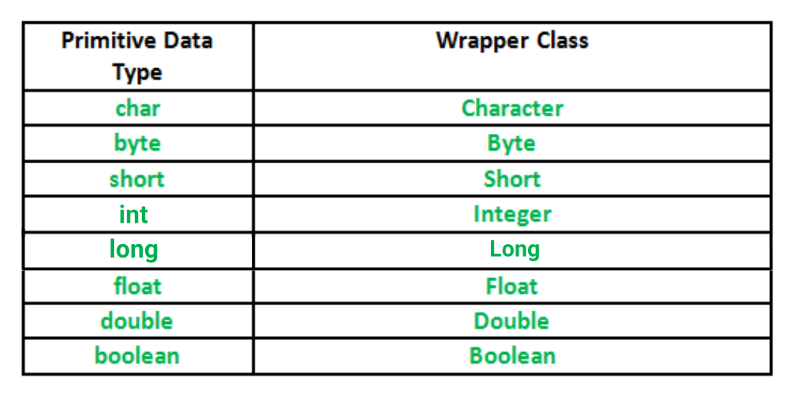

## Wrapper Classes in Java
A Wrapper class is a class whose object wraps or contains primitive data types. When we create an object to a wrapper class, it contains a field and in this field, we can store primitive data types. In other words, we can wrap a primitive value into a wrapper class object.

#### Need of Wrapper Classes
 - They convert primitive data types into objects. Objects are needed if we wish to modify the arguments passed into a method (because primitive types are passed by value).
 - The classes in java.util package handles only objects and hence wrapper classes help in this case also.
 - Data structures in the Collection framework, such as ArrayList and Vector, store only objects (reference types) and not primitive types.
 - An object is needed to support synchronization in multithreading.

#### Autoboxing in Java
**Autoboxing** refers to the conversion of a primitive value into an object of the corresponding wrapper class is called autoboxing. For example, converting int to Integer class. The Java compiler applies autoboxing when a primitive value is: 

 - Passed as a parameter to a method that expects an object of the corresponding wrapper class.
 - Assigned to a variable of the corresponding wrapper class.

#### Auto-unboxing in Java
**Unboxing** on the other hand refers to converting an object of a wrapper type to its corresponding primitive value. For example conversion of Integer to int. The Java compiler applies to unbox when an object of a wrapper class is: 
 - Passed as a parameter to a method that expects a value of the corresponding primitive type.
 - Assigned to a variable of the corresponding primitive type.

Now let us discuss a few advantages of autoboxing and unboxing in order to get why we are using it. 

- Autoboxing and unboxing lets developers write cleaner code, making it easier to read.
- The technique lets us use primitive types and Wrapper class objects interchangeably and we do not need to perform any typecasting explicitly.